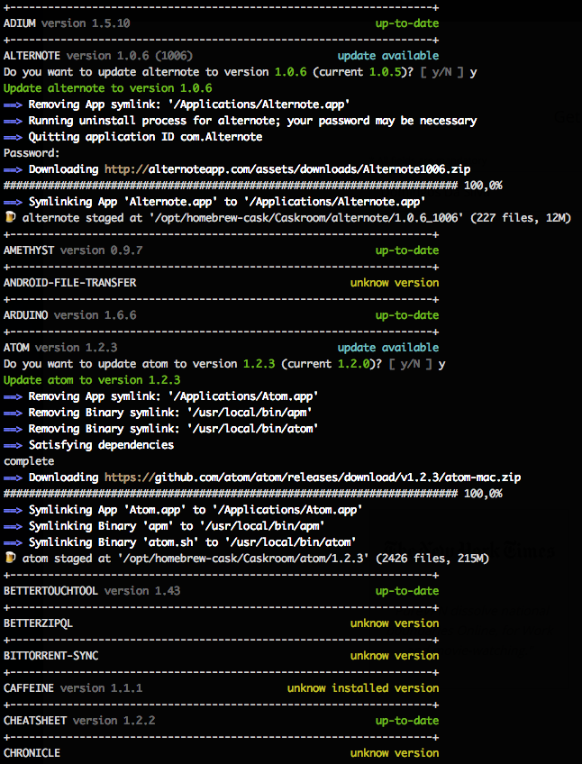

# Homebrew Cask Upgrade

Another workaround solution to upgrade installed cask
Update Homebrew Cask and **verify installed applications versions** with Casks to **perform an upgrade**
The app prompt to update only if the Cask contain a **version number** and the installed **app version** can be retrieved.

Application are **uninstalled and resintalled** with brew cask

[https://github.com/atika/brew-cask-upgrade](https://github.com/atika/brew-cask-upgrade)

### Usage :
* **cask-upgrade      :** prompt each time it encouter an update to install it
* **cask-upgrade auto :** will upgrade applications automatically
* **cask-upgrade atom :** will search for an application called atom and upgrade it

